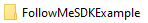
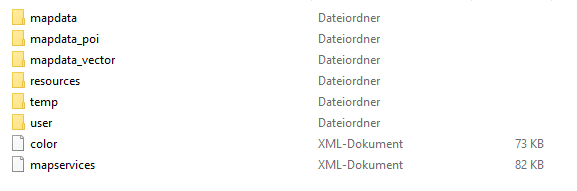
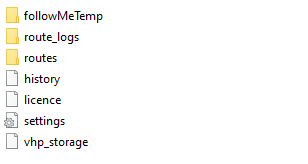

# FollowMe SDK Example

This project is meant to help anyone who wants to use our SDK to create their own FollowMe Application.  
It consists of an Android Studio Project with commented code, in which you can see how we handle the SDK-functions and -callbacks.

## Setup

To use this App, you have to make a few preparations first.
Contact the [infoware support](https://www.infoware.de/kontakt/) to get the resource package for the FollowMeSDKExample App and a demo-licence.

In our SDK package a "FollowMeSDKExample" folder is included. This folder needs to be present on the root-directory of your device. Simply copy it over after you added the licence.

Inside this folder, you will find the following structure:

The folders mapdata, mapdata_poi and mapdata_vector contain the necessary map-files and can be exchanged if you already have a map-package.
The user folder is where you need to place your licence.

You'll also find the routes folder inside the user directory. All your FollowMe files are getting read from this directory. 
You will have an example FollowMe-tour already available from our SDK package.

## Installing the App

The App needs to be built by yourself. You can either download the project or create a pull requests, and open it in Android Studio.
Now that you have the code base you can adjust the code if wanted, and create an APK or build it directly on your device.

## Using the App

On startup you will see our Splash Screen while the SDK gets initialized. 
Currently there is no error-management, so in case of a licence error you need to look at the Android Studio's logcat. 
When the SDK initialized successful the main menu gets shown with currently only the option 'List'.  
On click on the list-button all available FollowMe-files (.nmea or .csv) will get parsed from the /user/routes directory and are shown on screen.
When you select a file a Dialog will pop up, asking if you want to start the route as a simulation or a normal navigation.  
Choosing either of those options will bring you to the CompanionMap, and the route will get calculated and started when it’s done.

### Example Video

